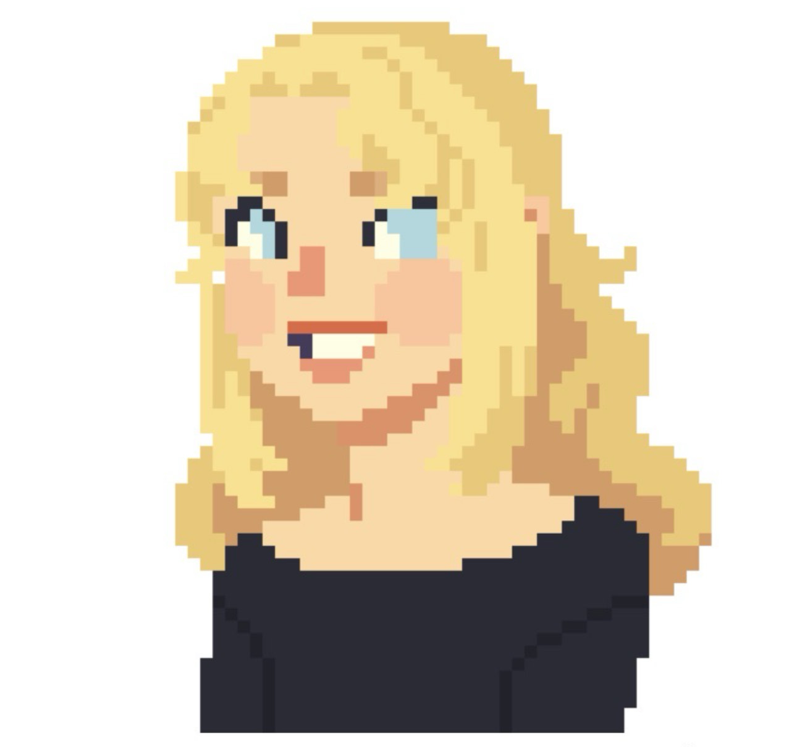

  

  

<!-- Quick badges -->

  
  
  

I’m a software analyst and developer passionate about building creative and impactful technology. I’ve worked on multiple projects that have given me a broad understanding technology, making me love to blend research with hands-on development.

### 🌎 Find me around the web:

- 💼 Sharing updates on [LinkedIn](https://www.linkedin.com/in/madalina-bulat-92a046115/)
- 📝 Writing & documenting projects here on GitHub  
- 🎨 Exploring creativity through side projects 
